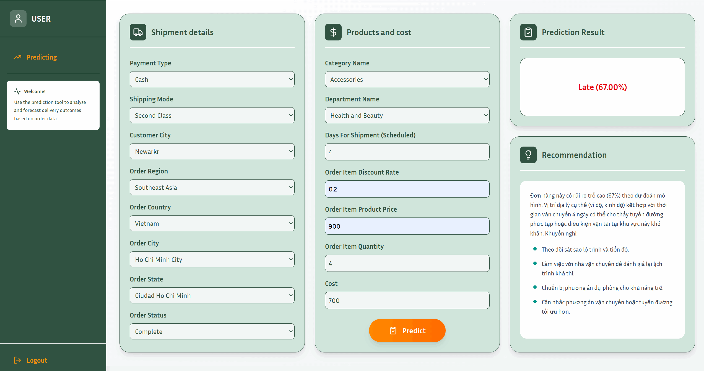
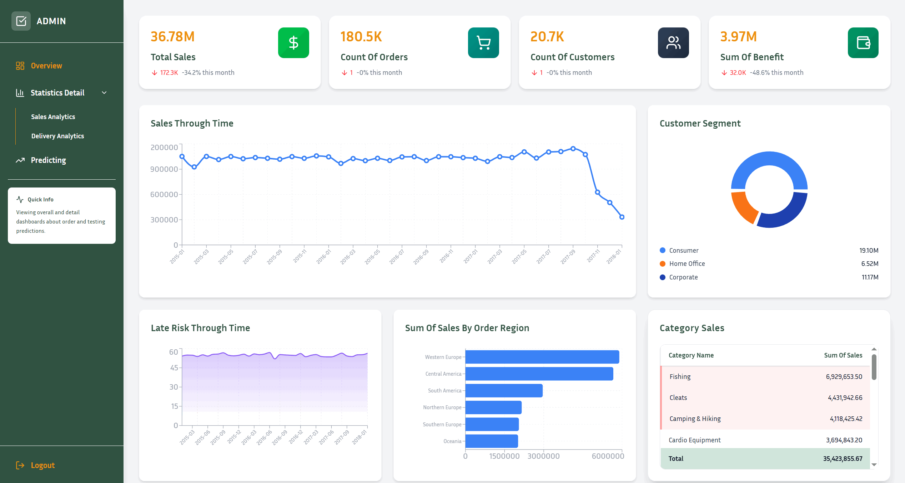
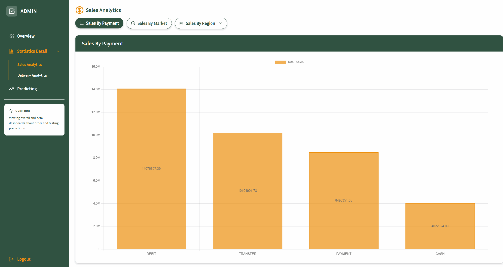
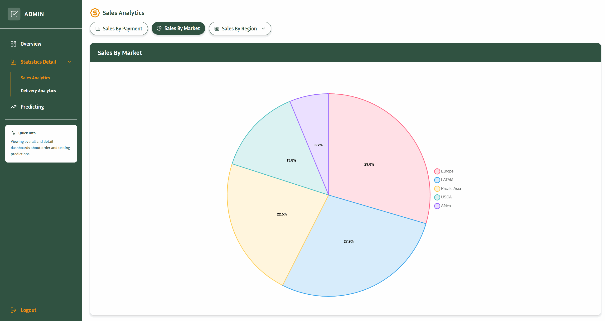
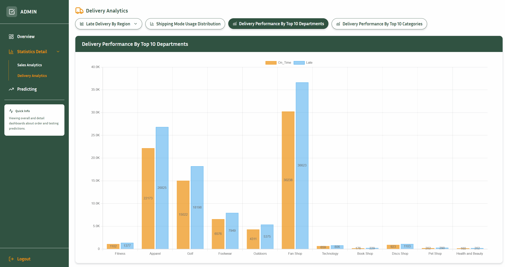
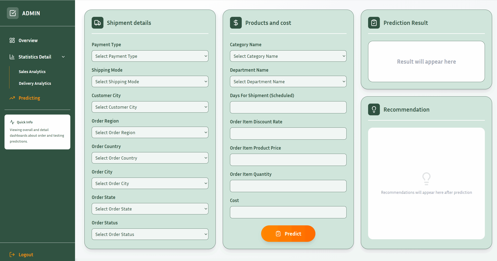
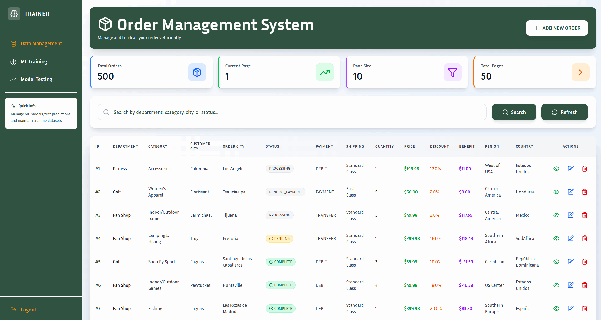
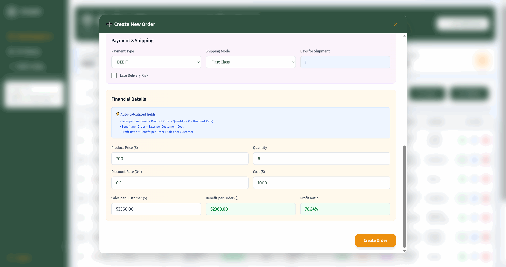
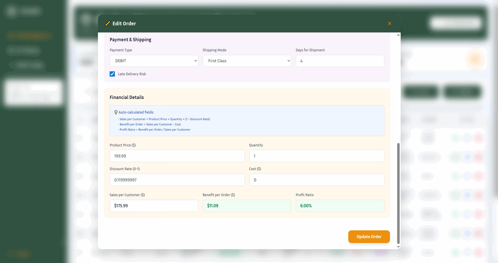
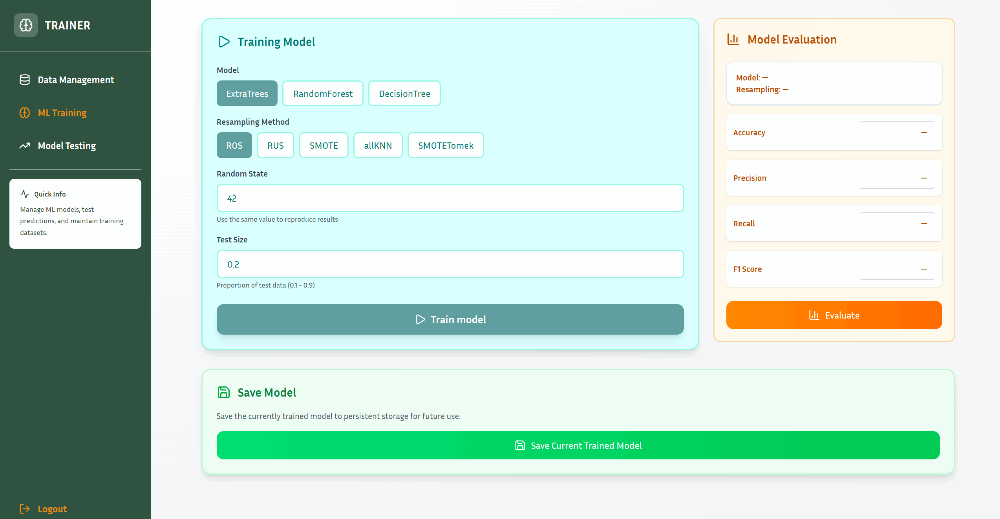

# 🚚 Delivery Risk & Price Prediction

A full stack application that uses supply chain data to forecast delivery risks.  This project makes use of **React + Vite (frontend)** and **Django (backend)** to offer a smooth interface for investigating supply chain records and identifying possible delayed deliveries.

The backend handles:
- 📊 Data ingestion and preprocessing
- 🧠 Machine learning model integration (trained with supply chain dataset)
- 🔌 RESTful APIs for frontend communication

The frontend provides:
- 🎨 Interactive dashboards and visualizations
- 🔍 Delivery risk predictions
- 📈 User-friendly interface for exploring supply chain insights

## 📑 Table of Contents

- [Project Structure](#project-structure)
- [Database Setup](#database-setup)
- [Backend Setup](#backend-setup)
- [Frontend Setup](#frontend-setup)
- [Screenshots](#screenshots)
- [License](#license)
---
### 🗂️ Project structure
```bash
delivery-risk-price-predict
│── backend
│   ├── backend
│   ├── models    # Trained model folder 
│   ├── order
│         ├── management
│         ├──     ├── commands
│         ├──            ├── upload_order_ml.py
│         ├──            ├── upload_records.py
│         ├── migrations
│         ├── __init__.py
│         ├── admin.py
│         ├── models.py
│         ├── serializers.py
│         ├── urls.py
│         ├── views.py
│   ├── user
│         ├── migrations
│         ├── __init__.py
│         ├── admin.py
│         ├── apps.py 
│         ├── ...
│
│   ├── .env
│   ├── manage.py 
│   ├── DataCoSupplyChainDataset.csv 
│   ├── df_sample_500.csv 
│   ├── extratrees_resampling.pkl 
│   ├── Register_user.md
│── frontend
│   ├── public
│   ├── src
│         ├── assets
│         ├── components
│         ├── data
│         ├── pages
│         ├──   ├── 
│         ├──   ├── Crud.jsx
│         ├──   ├── Login.jsx
│         ├──   ├── Overview.jsx
│         ├──   ├── Predicting.jsx
│         ├──   ├── PredictingTrainer.jsx
│         ├──   ├── Register.jsx
│         ├──   ├── StatisticsDetail.jsx
│         ├──   ├── Training.jsx
│         ├── routes
│         ├── utils
│         ├── App.css
│         ├── App.jsx
│         ├── index.css
│         ├── main.jsx
│   ├── .gitignore
│   ├── eslint.config.js
│   ├── index.html
│   ├── package-lock.json
│   ├── package.json
│   ├── vite.config.js
│── .gitignore
│── requirements.txt
│── README.md
```
## 🗄️ Database Setup
Run this script within your MySQL server
```sql
DROP DATABASE IF EXISTS latedeliverydb;

CREATE DATABASE latedeliverydb CHARACTER SET utf8mb4 COLLATE utf8mb4_unicode_ci;

CREATE USER IF NOT EXISTS 'user123'@'localhost' IDENTIFIED BY 'password123';

GRANT ALL PRIVILEGES ON latedeliverydb.* TO 'user123'@'localhost';

FLUSH PRIVILEGES;
```
## 🛠️Backend Setup 

### 1. Navigate to Backend folder
```bash
cd delivery-risk-price-predict
```

### 2. Create and activate a virtual environment:
```bash
python -m venv venv
```
Then activate them
```bash
venv\Scripts\activate 
```

### 3. Install backend dependencies:
```bash
pip install -r requirements.txt
```

### 4. Create Migrations
```bash
cd backend
python manage.py makemigrations
```

### 5. Apply Migrations
```bash
python manage.py migrate
```
### 6. Download required data and model files
**[Download from MediaFire](https://www.mediafire.com/file/htqbz41hljjfupt/Data_Model.rar/file)**
- A folder containing 2 data files and 1 trained model file (.pkl) is hosted on MediaFire.

- Download the entire folder from the provided MediaFire link.

- Place all files inside the backend/ directory before proceeding.

❗ Without these files, the bulk upload, visualization and prediction features will not work.

### 7. Bulk Files
Bulk DataCoSupplyChainDataset.csv
```bash
python manage.py upload_records DataCoSupplyChainDataset.csv
```
Bulk df_sample_500.csv
```bash
python manage.py upload_order_ml df_sample_500.csv
```
Fill the environment file
```bash
GEMINI_API_KEY = "" 
```
### 8. Run the Django development server:
```bash
python manage.py runserver
```
The backend server will be available at: *http://localhost:8000*

## 🖼️ Frontend Setup
## 1. Navigate to the frontend directory
```bash
cd frontend
```
## 2. Install dependencies
```bash
npm install
```
## 3. Run the React development server:
```bash
npm run dev
```
**NOTE**: Make sure that you have already installed Nodejs

The frontend server will be available at: *http://localhost:5173*

## 🎨 Screenshots
### 🙍🏻‍♂️ User Interface

### ⚜️ Admin Interface






### 🚀 Trainer Interface





## 📜 License
This project is licensed under the MIT License.

